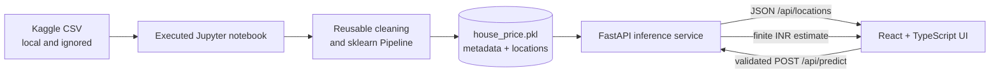
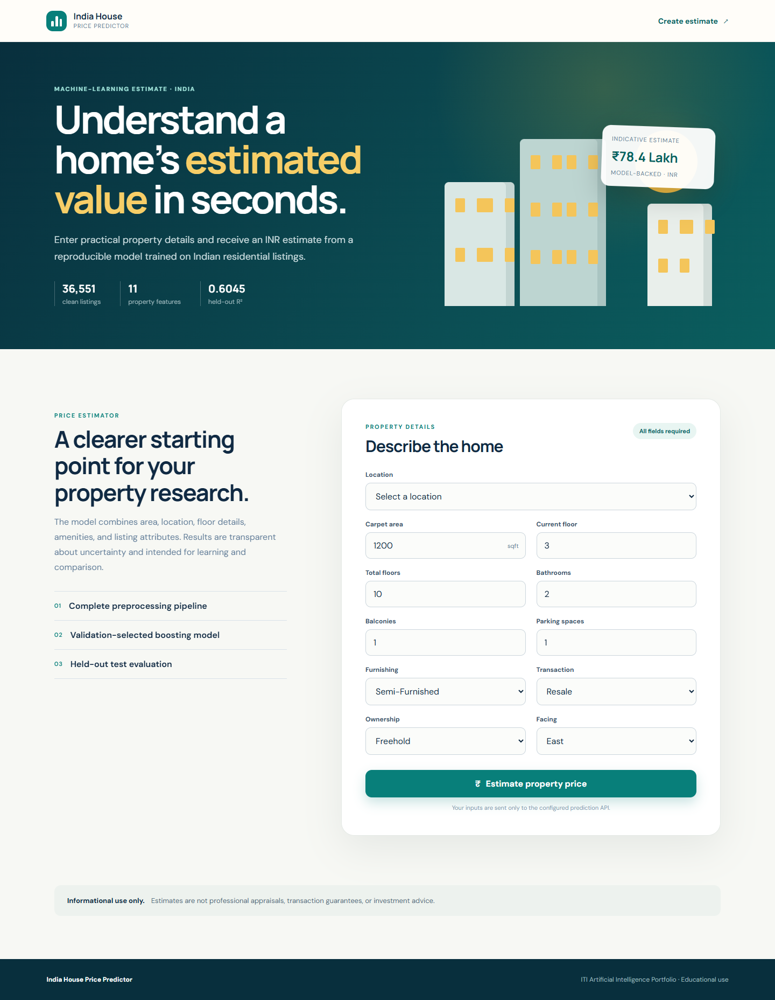
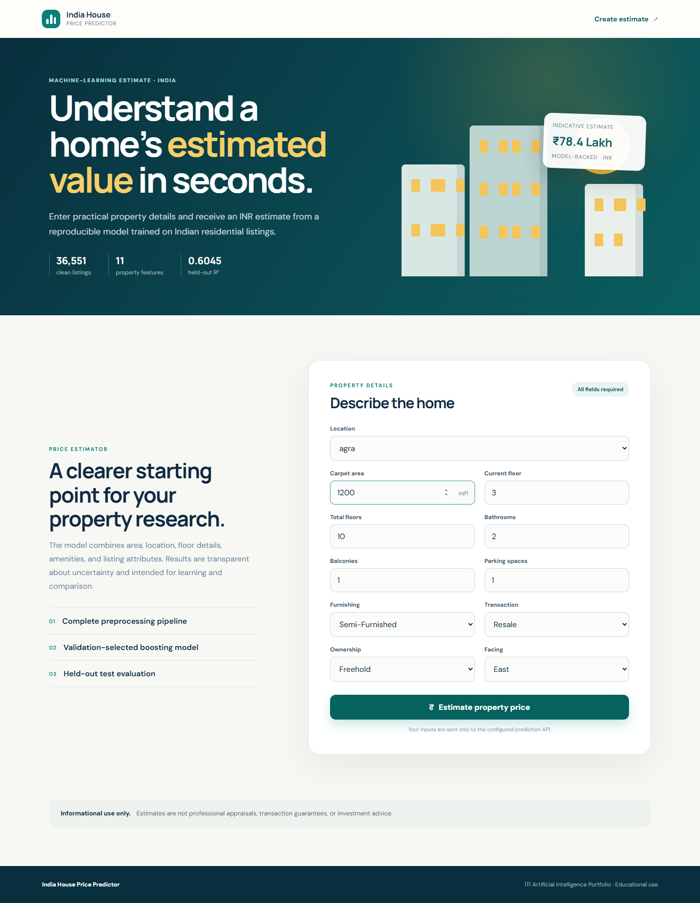
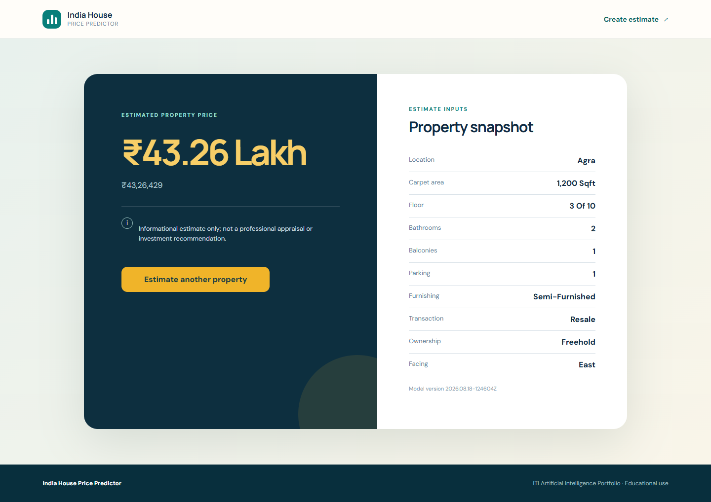
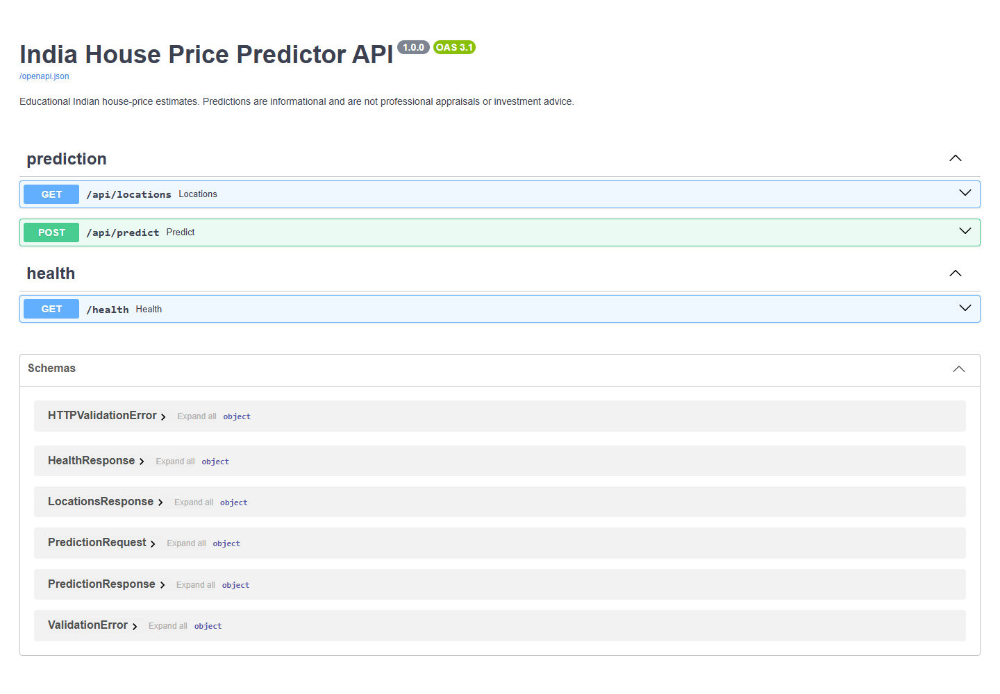

# India House Price Predictor

A complete ITI final project that turns a reproducible house-price regression pipeline into a tested web application. The repository includes an executed modeling notebook, a compact exported scikit-learn pipeline, a validated FastAPI service, and a responsive React interface. Predictions are denominated in Indian rupees (INR).

> **Informational use only:** Predictions are educational estimates based on historical advertised listing prices. They are not professional appraisals, transaction guarantees, or investment recommendations.

## Highlights

- Audits 187,531 raw listings without committing the 101.23 MiB source CSV.
- Parses Indian price notation and multiple observed area/floor formats with tested reusable functions.
- Prevents target leakage, deduplicates before splitting, and learns rare-location grouping from training data only.
- Compares a dummy baseline, ridge regression, and histogram gradient boosting using validation and five-fold cross-validation.
- Preserves an untouched 7,311-row test set until model selection is complete.
- Serves the full fitted pipeline through strict Pydantic v2 schemas and loads it only once at application startup.
- Provides loading, validation, error, retry, result, and 404 experiences in an accessible React UI.
- Includes unit, integration, browser E2E, container, dependency, and publication-readiness checks.

## Architecture



The raw dataset is needed only to retrain the notebook. The committed model, metadata, and location vocabulary are sufficient to run the API and frontend.

## Technology stack

| Layer | Technologies |
| --- | --- |
| Data and modeling | Python 3.11, pandas, NumPy, scikit-learn, Jupyter, Matplotlib, seaborn |
| Backend | FastAPI, Pydantic v2, pydantic-settings, Uvicorn |
| Frontend | React 19, TypeScript, Vite, React Router |
| Quality | Pytest, Ruff, mypy, Vitest, Testing Library, Playwright, pip-audit, npm audit |
| Packaging | Docker Compose, non-root Python and nginx containers |

## Project structure

```text
Final-Project/
├── README.md
├── .env.example
├── .dockerignore
├── docker-compose.yml
├── pyproject.toml
├── notebooks/
│   ├── house_price_model.ipynb
│   ├── requirements.txt
│   └── data/README.md
├── models/
│   ├── house_price.pkl
│   ├── locations.json
│   └── model_metadata.json
├── backend/
│   ├── app/{api,core,schemas,services,utils}/
│   ├── tests/
│   ├── requirements.txt
│   ├── requirements-dev.txt
│   └── Dockerfile
├── frontend/
│   ├── src/{api,components,pages,test,types}/
│   ├── e2e/
│   ├── package.json
│   ├── playwright.config.ts
│   └── Dockerfile
├── docs/
│   ├── data-audit.md
│   ├── model-report.md
│   └── screenshots/
└── scripts/
    ├── smoke_test.py
    └── verify_project.py
```

## Dataset

The project uses [House Price by Juhi Bhojani on Kaggle](https://www.kaggle.com/datasets/juhibhojani/house-price). The audited `house_prices.csv` contains 187,531 rows and 21 columns, is 106,149,815 bytes, and has SHA-256:

```text
ED1E6A1A2D1158F458CEF164F7E977F2C32A1EE392AD218037C11851814EF1E3
```

Download details and the expected local path are in [notebooks/data/README.md](notebooks/data/README.md). With the Kaggle CLI configured, run from `Final-Project`:

```powershell
kaggle datasets download -d juhibhojani/house-price -p notebooks/data --unzip
```

The CSV and archives are ignored by Git. A future Kaggle revision with a different checksum requires a fresh audit before retraining.

### Cleaning and feature engineering

- Removes 119,339 exact source duplicates across all fields except the unique `Index`.
- Parses rupees, commas, `Lac`/`Lakh`, `Cr`/`Crore`, and unavailable price markers into one INR target.
- Converts observed `sqft`, `sqm`, `sqyrd`, acre, hectare, cent, marla, kanal, and ground area units; ambiguous regional units are rejected rather than guessed.
- Parses ground as floor 0 and basement as -1, while retaining current and total floors.
- Applies a predetermined broad integrity range to the full population, then learns tighter price-per-square-foot limits from training rows only.
- Excludes identifiers, listing text, high-cardinality society names, empty/constant columns, duplicate price fields, and price-per-area leakage.
- Imputes missing values inside the fitted pipeline and maps rare or unseen locations to `Other` using fit-only state.

The final modeling population contains 36,551 unique listings and 11 inputs: carpet area, current floor, total floors, bathrooms, balconies, parking, location, furnishing, transaction, ownership, and facing. See the factual [data audit](docs/data-audit.md) and detailed [model report](docs/model-report.md).

## Modeling results

Candidate selection used the training/validation data only. The test set remained untouched until histogram gradient boosting won on the predeclared validation MAE.

| Model | Validation MAE | Validation RMSE | Validation R² | Fit time |
| --- | ---: | ---: | ---: | ---: |
| Histogram gradient boosting, log target | ₹3,061,149 (30.6115 lakh) | ₹9,989,151 (99.8915 lakh) | 0.6073 | 3.1074 s |
| Ridge regression | ₹4,270,159 (42.7016 lakh) | ₹11,785,090 (117.8509 lakh) | 0.4534 | 0.1150 s |
| Dummy median | ₹6,647,547 (66.4755 lakh) | ₹16,483,930 (164.8393 lakh) | -0.0693 | 0.1141 s |

Five-fold cross-validation on a fixed 20,000-row training-only sample gave the selected model a mean MAE of ₹2,520,994 ± ₹64,412 and mean R² of 0.7782.

### One-time held-out test metrics

| Metric | Value |
| --- | ---: |
| MAE | ₹3,102,652.55 (31.0265 lakh) |
| RMSE | ₹10,924,915.85 (109.2492 lakh) |
| R² | 0.6045 |
| Test rows | 7,311 |
| Total prediction time | 0.1729 s |

The serialized pipeline is 445,708 bytes (0.425 MiB) and was reloaded successfully in the executed notebook with an identical held-out sample prediction.

## Setup

### Prerequisites

- Git
- Python 3.11
- Node.js 20 or newer and npm
- Optional: Docker Desktop with Compose v2
- Optional for retraining only: a Kaggle account and the separately downloaded CSV

### Python environment

From `Final-Project` in PowerShell:

```powershell
py -3.11 -m venv .venv
Set-ExecutionPolicy -Scope Process -ExecutionPolicy Bypass
.\.venv\Scripts\Activate.ps1
python -m pip install --upgrade pip
python -m pip install -r backend/requirements-dev.txt -r notebooks/requirements.txt
```

On Linux or macOS, create the environment with `python3.11 -m venv .venv` and activate it with `source .venv/bin/activate`.

### Execute the notebook

Place the dataset at `notebooks/data/house_prices.csv`, then run:

```powershell
python -m ipykernel install --user --name iti-final-project --display-name "ITI Final Project"
python -m jupyter nbconvert --to notebook --execute --inplace notebooks/house_price_model.ipynb --ExecutePreprocessor.kernel_name=iti-final-project --ExecutePreprocessor.timeout=1800
```

The saved notebook is already fully executed for GitHub review. Retraining overwrites the committed model artifacts with newly measured results.

### Run the backend

```powershell
Copy-Item .env.example .env
python -m uvicorn backend.app.main:app --host 0.0.0.0 --port 8000
```

Open Swagger at `http://localhost:8000/docs` and health at `http://localhost:8000/health`.

### Run the frontend

In a second terminal:

```powershell
Set-Location frontend
Copy-Item .env.example .env
npm ci
npm run dev
```

Open `http://localhost:5173`.

### Run with Docker

No raw dataset is needed because the trusted local model artifacts are committed.

```powershell
docker compose up --build --wait
python scripts/smoke_test.py
docker compose down
```

The backend runs at port 8000 and the non-root nginx frontend at port 5173. Both images use non-root runtime users.

## Environment variables

### Backend

| Variable | Default | Purpose |
| --- | --- | --- |
| `HOUSE_ENVIRONMENT` | `development` | Environment label used by configuration |
| `HOUSE_LOG_LEVEL` | `INFO` | Structured application log level |
| `HOUSE_MODEL_PATH` | `models/house_price.pkl` | Trusted pipeline artifact path |
| `HOUSE_LOCATIONS_PATH` | `models/locations.json` | Location vocabulary path |
| `HOUSE_METADATA_PATH` | `models/model_metadata.json` | Model version and metrics path |
| `HOUSE_CORS_ORIGINS` | `["http://localhost:5173"]` | JSON array of permitted browser origins |

### Frontend

| Variable | Default | Purpose |
| --- | --- | --- |
| `VITE_API_BASE_URL` | `http://localhost:8000` | Prediction API origin compiled into the frontend |

Commit `.env.example` files only. Local `.env` files are intentionally ignored.

## API reference

| Method | Path | Response |
| --- | --- | --- |
| `GET` | `/health` | Service/model readiness and model version |
| `GET` | `/api/locations` | Trained location list plus `Other` fallback label |
| `POST` | `/api/predict` | Validated finite INR prediction and disclaimer |
| `GET` | `/docs` | Interactive OpenAPI/Swagger documentation |

Example request:

```bash
curl -X POST http://localhost:8000/api/predict \
  -H "Content-Type: application/json" \
  -d '{
    "location": "agra",
    "carpet_area_sqft": 1200.0,
    "floor_num": 3,
    "total_floors": 10,
    "bathroom": 2,
    "balcony": 1,
    "parking": 1,
    "furnishing": "Semi-Furnished",
    "transaction": "Resale",
    "ownership": "Freehold",
    "facing": "East"
  }'
```

Example response from model version `2026.08.18-124604Z`:

```json
{
  "predicted_price": 4326428.91,
  "formatted_price": "₹43.26 Lakh",
  "currency": "INR",
  "model_version": "2026.08.18-124604Z",
  "disclaimer": "Informational estimate only; not a professional appraisal or investment recommendation."
}
```

Unknown location strings are safely transformed to `Other`. Extra fields, missing fields, incorrect types, non-finite values, and out-of-range values receive a 422 response.

## Testing and quality checks

From `Final-Project` with the Python environment active:

```powershell
python -m ruff check backend scripts
python -m mypy backend scripts
python -m pytest backend/tests
python -m pip_audit -r backend/requirements.txt
python scripts/verify_project.py
```

From `Final-Project/frontend`:

```powershell
npm run lint
npm test
npm run build
npm audit
```

With the stack running, browser and HTTP checks are:

```powershell
python scripts/smoke_test.py
npm --prefix frontend run test:e2e
```

The Playwright suite uses installed Microsoft Edge by default and verifies real API submission, client validation, result refresh, 404 routing, mobile overflow, Swagger rendering, and absence of console errors in the main flow.

## Screenshots

### Home page



### Completed prediction form



### Prediction result



### FastAPI Swagger



These PNGs were captured from the running Docker Compose stack during the automated Edge E2E test; they are not mockups.

## Reproducibility, privacy, and security

- Random seed 42 controls splitting, cross-validation, and compatible estimators.
- Versioned metadata records dataset checksum, split sizes, schema, parameters, metrics, timing, and library versions.
- Backend requirements pin scikit-learn 1.6.1, matching the serialized pipeline.
- The notebook uses only relative paths and verifies the model after reloading it.
- CSV files, archives, credentials, `.env`, virtual environments, caches, `node_modules`, and build output are excluded by Git rules and the Docker context.
- Listing titles, descriptions, and society identifiers are neither model inputs nor application responses.
- The API loads only explicitly configured, trusted local pickle artifacts. Never load an untrusted pickle.

## Limitations

- Advertised listing prices can differ from completed transaction prices.
- The data is historical and does not incorporate current market movement.
- Optional property features contain substantial missingness.
- Exact deduplication does not identify every near-duplicate listing.
- Location is categorical; the model has no coordinates or neighborhood-distance context.
- Luxury and unusual listings have much larger errors, as reflected by the RMSE and tail-error analysis.
- The interface shows a point estimate, not a calibrated prediction interval.
- This educational application is not production-ready.

## Future improvements

- Add time-aware training data and monitor market/model drift.
- Geocode properties and engineer transparent neighborhood features.
- Add calibrated prediction intervals and subgroup error reporting.
- Evaluate stronger constrained boosting models under the same leakage-safe split.
- Add continuous integration for tests, audits, and container builds.
- Deploy behind TLS with rate limiting and operational monitoring if the project is ever promoted beyond demonstration use.
